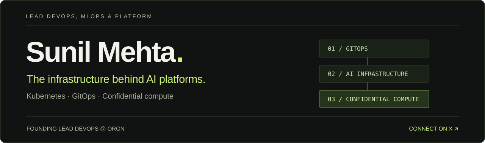

  <a href="https://www.linkedin.com/in/sunilmehta695/"><strong>LinkedIn ↗</strong></a>
  &nbsp;&nbsp;·&nbsp;&nbsp;
  <a href="https://orgn.com">Building at ORGN</a>
  &nbsp;&nbsp;·&nbsp;&nbsp;
  <a href="https://x.com/Sunilmehta_695"><strong>Connect on X</strong></a>

## I build the infrastructure AI products run on.

I'm **Sunil Mehta**, a lead DevOps, MLOps and platform engineer and founding lead at **[ORGN](https://orgn.com)**. I work across cloud infrastructure, confidential computing, identity, and the systems that turn AI capabilities into dependable products.

My scope runs from `terraform plan` to production traffic: **Kubernetes and GitOps, confidential compute, and secure delivery pipelines**.

### Selected engineering work

| Area | What I've built and operated |
| :--- | :--- |
| **Confidential computing** | Hardware-isolated Kubernetes sandboxes on Intel TDX, with remote attestation and network policy. |
| **AI infrastructure** | An LLM gateway across providers, with metering, spend controls, and GitOps delivery. |
| **Cloud platforms** | Multi-cloud Kubernetes across GKE and DigitalOcean; Terraform across GCP and AWS; Argo CD reconciliation and keyless CI/CD. |
| **Identity & security** | An OAuth 2.1 / OIDC authorization server, and a zero-downtime migration onto GKE and Cloud SQL. |
| **Reliability & cost** | Prometheus, Grafana, OpenTelemetry, and ClickHouse; infrastructure cost reductions through right-sizing, consolidation, and scale-to-zero policies. |

*These highlights describe my professional experience. Most of the underlying work lives in private organization repositories.*

### Tools I work with

**Infrastructure** &nbsp; Kubernetes · Terraform · Argo CD · Helm · GCP · AWS · DigitalOcean · Cloudflare 
**Systems & services** &nbsp; Go · Rust · TypeScript · Python · PostgreSQL · Redis 
**Security** &nbsp; Intel TDX · OAuth 2.1 / OIDC · Kyverno · OPA 
**Observability** &nbsp; Prometheus · Grafana · Loki · Tempo · OpenTelemetry · ClickHouse

### How I work

- **Make changes reviewable.** Reproducible plans, GitOps reconciliation, and keyless delivery.
- **Make failures understandable.** Useful telemetry, explicit failure modes, and written runbooks.
- **Make correctness repeatable.** Regression tests for security fixes, billing paths, and migrations.
- **Own the whole path.** Design, delivery, operations, and the details between them.

---

**Building AI platforms, developer tools, or secure infrastructure?** 
[Connect on LinkedIn](https://www.linkedin.com/in/sunilmehta695/) · [Connect on X](https://x.com/Sunilmehta_695) · [Email me](mailto:sunilmehta695@gmail.com)
